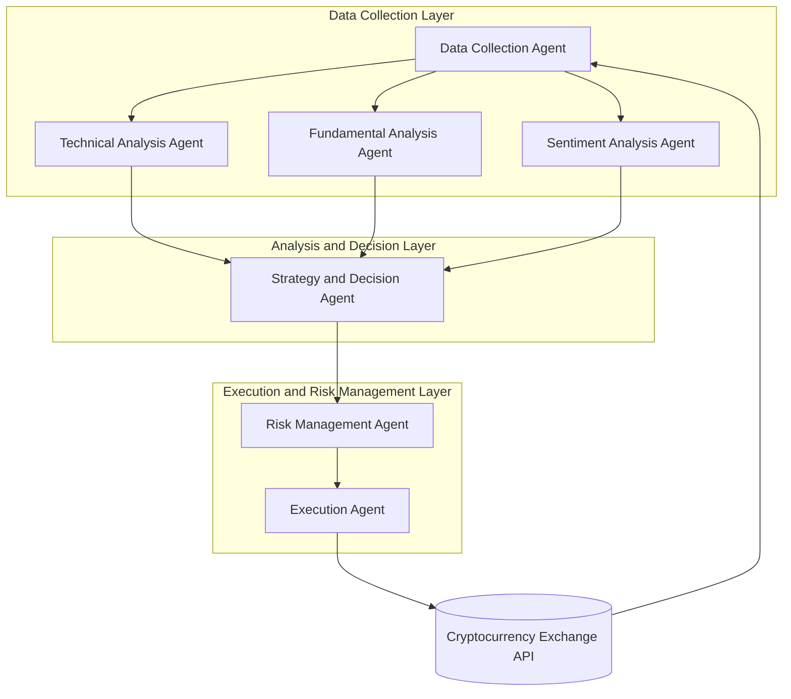

# Multi-Agent Cryptocurrency Trading System Development Guide

## Introduction

This report presents comprehensive research and guidance on how to design and develop a multi-agent AI-based system for cryptocurrency trading operations. The 24/7 nature of cryptocurrency markets, their high volatility, and the massive amounts of data they generate make automation and artificial intelligence particularly attractive in this domain. Multi-agent systems address these challenges by breaking down complex tasks into smaller, manageable components, allowing specialized agents to collaborate effectively in their respective areas of expertise.

This guide covers the entire process from conceptual framework to analysis of existing technologies, system architecture design, and finally a step-by-step implementation strategy.

---

## Chapter 1: Multi-Agent Crypto Trading Systems Research

### 1.1. Fundamental Concepts and Architectures

Multi-agent trading systems typically consist of autonomous agents, each responsible for different aspects of the trading process. Our research identified two primary architectural approaches:

**Layered Architecture:** This approach divides the system into layers such as Data Collection, Analysis and Decision-Making, and Execution and Risk Management. Each layer contains agents with different responsibilities.

**Role-Based Architecture:** This approach simulates a trading firm with agents taking on different roles such as analysts, researchers, traders, and risk managers. These agents collaborate through structured communication protocols.

### 1.2. Notable Academic and Industry Studies

Our research revealed a rising trend in Large Language Model (LLM)-based multi-agent systems. Key studies examined include:

**Designing a Detailed Multi-Agent Trading System Using Chatbots and AI:** This study proposes a system built on five fundamental agent roles: Market Selection, Asset Prediction, Entry Timing, Monitoring, and Decision-making. The system demonstrates how specialized agents can work together to analyze macroeconomic factors, sentiment, and technical indicators to make informed trading decisions.

**LLM-Powered Multi-Agent System for Automated Crypto Portfolio Management (Arxiv):** This academic paper presents an explainable, multi-modal framework where specialized agents work in teams. The system fine-tunes agents using historical data and professional investment literature to make more accurate decisions. The framework includes unique intra-team and inter-team collaboration mechanisms that enhance prediction accuracy.

**TradingAgents Framework:** This study defines seven distinct agent roles (Fundamental, Sentiment, News, and Technical Analysts, Researcher, Trader, Risk Manager) that simulate a professional trading firm. The framework is particularly notable for its structured communication and dialectical debate processes that ensure balanced analysis.

### 1.3. Key Findings from Research

The research reveals several critical insights about multi-agent trading systems:

Multi-agent systems consistently outperform single-agent models and market benchmarks in classification, asset pricing, portfolio management, and explainability performance. The collaborative nature of these systems allows for more comprehensive market analysis by combining different perspectives and expertise areas.

The most successful implementations utilize structured communication protocols rather than unstructured dialogue, preserving essential information and enabling direct queries from the global state. This approach minimizes information loss and maintains context over long interactions.

---

## Chapter 2: Analysis of Existing Solutions and Technologies

### 2.1. Cryptocurrency Exchange APIs

Reliable and comprehensive exchange APIs are critical for successful trading bots. Our analysis identified three major exchange APIs:

| Exchange | Advantages | Disadvantages |
|---|---|---|
| **Binance** | - Broadest asset coverage<br>- Advanced trading features (futures, options)<br>- High liquidity and low fees | - Regulatory uncertainties<br>- Can be complex for beginners |
| **Coinbase** | - User-friendly interface<br>- High security and US regulatory compliance<br>- Strong institutional solutions | - Limited asset selection<br>- Relatively high transaction fees |
| **Kraken** | - High security standards<br>- API suitable for algorithmic and high-frequency trading<br>- Good customer support | - Less intuitive interface<br>- Lower liquidity compared to Binance |

### 2.2. Multi-Agent Development Frameworks

The Python ecosystem offers various frameworks for developing multi-agent systems:

**CrewAI** facilitates role-based agent creation with high-level abstraction, making it ideal for beginners. The framework provides collaborative AI agent teams that can be trusted to perform complex tasks autonomously and at scale.

**LangGraph** is part of the LangChain ecosystem, offering more control and flexibility through a graph-based structure. It allows for complex agent interactions and state management, making it suitable for sophisticated multi-agent workflows.

**Agno (formerly Phidata)** offers ready-made UI components and easy deployment options. It's a Python-based framework for converting large language models into agents for AI products, working with both closed and open LLMs.

**Microsoft Agent Framework** provides .NET and Python support with enterprise-focused solutions and Microsoft ecosystem integration.

### 2.3. Existing Trading Bot Platforms

The market offers both commercial and open-source trading bot platforms:

**Commercial Platforms:** Cryptohopper (AI features, strategy marketplace), 3Commas (DCA bots, grid trading), Pionex (built-in trading bots), and WunderTrading (automated crypto trading platform).

**Open-Source Solutions:** Gekko (Node.js-based), Freqtrade (Python-based), Zenbot (genetic algorithm support), and Catalyst (quantitative analysis).

### 2.4. API Integration Requirements

Successful implementation requires several key technical capabilities:

**Core Features** include real-time market data access, order placement and management, account balance tracking, historical data access, WebSocket connections, and proper rate limiting handling.

**Security Requirements** encompass API key management, IP whitelisting, signature authentication, SSL/TLS encryption, and two-factor authentication support.

**Performance Requirements** involve low latency connections, rate limit optimization, robust error handling and retry logic, connection pooling, and async/await patterns for efficient resource utilization.

---

## Chapter 3: Technical Architecture and Requirements

### 3.1. System Architecture

The proposed system follows a modular, microservices-based architecture designed for scalability and maintainability. The system consists of autonomous AI agents, each specialized in specific tasks, working either independently or collaboratively to make and execute cryptocurrency trading decisions.

The system is organized into three main layers:

**Data Collection Layer** gathers and processes market data, news, and social media sentiment through specialized agents that interface with various data sources including cryptocurrency exchanges, news APIs, and social media platforms.

**Analysis and Decision Layer** contains agents that analyze collected data, develop trading strategies, and generate trading signals. This layer includes technical analysis, fundamental analysis, and sentiment analysis agents that work together to provide comprehensive market insights.

**Execution and Risk Management Layer** houses agents responsible for converting generated signals into actual trading orders on exchanges and managing overall portfolio risk through position sizing, stop-loss management, and portfolio optimization.

### 3.2. Agent Roles and Responsibilities

The system defines seven core agent roles, each with specific responsibilities:

**Data Collection Agent** retrieves real-time and historical market data (price, volume) from cryptocurrency exchanges (Binance, Coinbase, Kraken, etc.), fetches financial news and articles from news sites and APIs (NewsAPI, etc.), and collects sentiment data related to cryptocurrencies from social media platforms (Twitter, Reddit, etc.).

**Technical Analysis Agent** calculates technical analysis indicators (RSI, MACD, Bollinger Bands, etc.) on collected market data, identifies chart patterns (support/resistance, trend lines), and generates short and medium-term trading signals based on technical analysis.

**Fundamental Analysis Agent** analyzes project whitepapers, roadmaps, and developer activities, examines tokenomics and on-chain metrics (transaction count, active addresses), and evaluates long-term investment potential based on fundamental factors.

**Sentiment Analysis Agent** performs natural language processing (NLP) on news and social media data to conduct sentiment analysis, determines market sentiment (positive, negative, neutral) and trending topics that may impact cryptocurrency prices.

**Strategy and Decision Agent** combines signals from technical, fundamental, and sentiment analysis agents, makes final buy, sell, or hold decisions according to predefined or dynamically developed trading strategies, and optimizes strategies using machine learning models.

**Risk Management Agent** monitors and manages overall portfolio risk, determines stop-loss and take-profit levels for positions, and optimizes position sizing and capital allocation to maintain appropriate risk levels.

**Execution Agent** converts decisions from the Strategy and Decision Agent into trading orders on exchanges via APIs, monitors order status (filled, cancelled, etc.), and controls slippage to ensure orders execute at optimal prices.

### 3.3. Technology Stack Selection

The recommended technology stack prioritizes Python for its rich ecosystem of data science, machine learning, and API integration libraries. CrewAI serves as the multi-agent framework due to its ease of role-based agent creation and high-level abstraction suitable for initial development.

**Core Technologies:**
- **Programming Language:** Python 3.10+
- **Multi-Agent Framework:** CrewAI
- **Data Analysis and Machine Learning:** Pandas, NumPy, Scikit-learn, TensorFlow/PyTorch
- **Exchange Integration:** CCXT library (supports multiple exchanges)
- **Database:** PostgreSQL (structured data), InfluxDB (time series data)
- **Message Queue:** RabbitMQ or Kafka (asynchronous communication between agents)

### 3.4. Data Flow and Communication

Agent communication occurs asynchronously through a message queue system, enhancing system flexibility and scalability. The data flow follows a structured pattern where the Data Collection Agent feeds information to analysis agents, which then provide insights to the Strategy and Decision Agent, ultimately leading to execution through the Risk Management and Execution Agents.



### 3.5. Hardware and Software Requirements

The system requires a cloud server with at least 4 CPU cores, 16 GB RAM, and 256 GB SSD storage (AWS, Google Cloud, Azure, etc.). The recommended operating system is Ubuntu 22.04 LTS or similar Linux distribution, with Python 3.10+, Docker, Docker Compose, and the specified technology stack components.

---

## Chapter 4: Implementation Strategy and Step-by-Step Guide

This chapter provides detailed instructions for implementing the designed system using Python and CrewAI framework.

### Step 1: Development Environment Setup

Begin by creating a virtual Python environment and installing required libraries. Create a new project directory and set up the development environment:

```bash
# Create and activate virtual environment
python3 -m venv venv
source venv/bin/activate

# Install required libraries
pip install crewai python-dotenv langchain-openai requests beautifulsoup4 pandas numpy scikit-learn ccxt
```

**Key Libraries:**
- **crewai:** Main framework for creating multi-agent systems
- **python-dotenv:** Managing sensitive information like API keys
- **langchain-openai:** Using OpenAI's LLMs
- **requests, beautifulsoup4:** Web scraping for data collection
- **pandas, numpy, scikit-learn:** Data analysis and machine learning
- **ccxt:** Standard library for cryptocurrency exchange interactions

Create a `.env` file in the project root directory and add your API keys:

```
OPENAI_API_KEY="sk-xxxxxxxxxxxxxxxxxxxxxxxxxxxxxx"
BINANCE_API_KEY="your_binance_api_key"
BINANCE_SECRET_KEY="your_binance_secret_key"
```

### Step 2: Defining Agents with CrewAI

Define agents using CrewAI's framework, where each agent has a role, goal, backstory, and tools. First, create custom tools for agent functionality:

```python
from langchain.tools import tool
import ccxt

class MarketDataTools:
    @tool("Get Market Data")
    def get_market_data(symbol: str):
        """Retrieves market data (OHLCV) for the specified symbol."""
        exchange = ccxt.binance()
        ohlcv = exchange.fetch_ohlcv(symbol, '1d', limit=100)
        return ohlcv

    @tool("Calculate RSI")
    def calculate_rsi(prices: list, period: int = 14):
        """Calculates RSI indicator for given price data."""
        # RSI calculation implementation
        pass
```

Create agents with specific roles and capabilities:

```python
from crewai import Agent
from langchain_openai import ChatOpenAI

# Define LLM
llm = ChatOpenAI(model="gpt-4.1-mini")

# Technical Analysis Agent
technical_analyst = Agent(
    role='Technical Analyst',
    goal='Analyze cryptocurrency market data to generate trading signals.',
    backstory='An experienced technical analysis expert with years of experience in financial markets.',
    tools=[MarketDataTools.get_market_data, MarketDataTools.calculate_rsi],
    llm=llm,
    verbose=True
)

# Additional agents defined similarly...
```

### Step 3: Defining Tasks

Create tasks that agents will perform using CrewAI's Task class:

```python
from crewai import Task

# Data analysis task
task_analyze_data = Task(
    description='Collect market data for BTC/USDT and perform technical analysis.',
    expected_output='A buy, sell, or hold recommendation based on technical indicators.',
    agent=technical_analyst
)

# Additional tasks defined for other agents...
```

### Step 4: Creating and Running the Crew

Combine agents and tasks into a Crew and execute the system:

```python
from crewai import Crew, Process

# Create the crew
crypto_trading_crew = Crew(
    agents=[technical_analyst, fundamental_analyst, sentiment_analyst, 
            strategy_agent, risk_manager, execution_agent],
    tasks=[task_analyze_data, task_fundamental_analysis, task_sentiment_analysis,
           task_make_decision, task_manage_risk, task_execute_trade],
    process=Process.SEQUENTIAL,
    verbose=2
)

# Execute the crew
result = crypto_trading_crew.kickoff()

print("######################")
print(result)
```

### Step 5: Testing and Iteration

**Backtesting:** Test your developed strategy on historical data to measure performance and validate the effectiveness of your trading algorithms.

**Paper Trading:** Test your strategy with real-time market data but virtual money to observe performance under live market conditions without financial risk.

**Optimization:** Based on test results, refine agent goals, tools, and strategies to improve overall system performance and profitability.

### Step 6: Production Deployment

For production deployment, consider implementing proper logging, monitoring, error handling, and security measures. Use containerization with Docker for consistent deployment across environments, and implement proper database management for storing historical data and trading records.

---

## Chapter 5: Advanced Considerations and Best Practices

### 5.1. Risk Management Strategies

Effective risk management is crucial for any automated trading system. Implement position sizing algorithms that limit exposure to any single trade or asset. Use stop-loss orders to limit potential losses and take-profit orders to secure gains. Diversify across multiple cryptocurrencies and trading strategies to reduce overall portfolio risk.

### 5.2. Performance Monitoring and Optimization

Continuously monitor system performance through key metrics such as Sharpe ratio, maximum drawdown, win rate, and average return per trade. Implement logging and alerting systems to track agent performance and identify potential issues before they impact trading results.

### 5.3. Regulatory and Compliance Considerations

Stay informed about cryptocurrency regulations in your jurisdiction. Ensure proper record-keeping for tax purposes and compliance with financial regulations. Consider implementing KYC (Know Your Customer) and AML (Anti-Money Laundering) procedures if required.

### 5.4. Security Best Practices

Implement robust security measures including secure API key storage, encrypted communications, regular security audits, and proper access controls. Use hardware security modules (HSMs) for storing sensitive cryptographic keys in production environments.

---

## Conclusion

This guide provides a comprehensive roadmap for developing a multi-agent AI-based cryptocurrency trading system. The proposed architecture and technology stack create a solid foundation for building a modular, scalable, and effective system. Success requires continuous research, testing, and iteration to adapt to changing market conditions and improve system performance.

The multi-agent approach offers significant advantages over traditional single-agent systems by enabling specialization, parallel processing, and collaborative decision-making. As the cryptocurrency market continues to evolve, these systems will likely become increasingly sophisticated and capable of handling complex trading scenarios.

Remember that cryptocurrency trading involves significant risks, and automated systems should be thoroughly tested and monitored. Always start with small amounts and gradually scale up as you gain confidence in your system's performance.

---

## References

1. Saghiri, A. M. (2024). *Designing a Detailed Multi-Agent Trading System Using Chatbots and AI*. Medium. [https://medium.com/@a.m.saghiri2008/designing-a-detailed-multi-agent-trading-system-using-chatbots-and-ai-general-solution-6db91e0510d7](https://medium.com/@a.m.saghiri2008/designing-a-detailed-multi-agent-trading-system-using-chatbots-and-ai-general-solution-6db91e0510d7)

2. Luo, Y., et al. (2025). *LLM-Powered Multi-Agent System for Automated Crypto Portfolio Management*. arXiv. [https://arxiv.org/abs/2501.00826](https://arxiv.org/abs/2501.00826)

3. TradingAgents. (n.d.). *TradingAgents: Multi-Agents LLM Financial Trading Framework*. [https://tradingagents-ai.github.io/](https://tradingagents-ai.github.io/)

4. GetStream. (2024). *Best 5 Frameworks To Build Multi-Agent AI Applications*. [https://getstream.io/blog/multiagent-ai-frameworks/](https://getstream.io/blog/multiagent-ai-frameworks/)

5. Coinbase. (n.d.). *Coinbase Developer Documentation*. [https://docs.cloud.coinbase.com/](https://docs.cloud.coinbase.com/)

6. CrewAI. (n.d.). *CrewAI Documentation*. [https://www.crewai.com/](https://www.crewai.com/)

7. CCXT. (n.d.). *CCXT – CryptoCurrency eXchange Trading Library*. [https://github.com/ccxt/ccxt](https://github.com/ccxt/ccxt)

8. Binance. (n.d.). *Binance API Documentation*. [https://binance-docs.github.io/apidocs/](https://binance-docs.github.io/apidocs/)

---

*Report prepared by **Manus AI** - October 2025*
