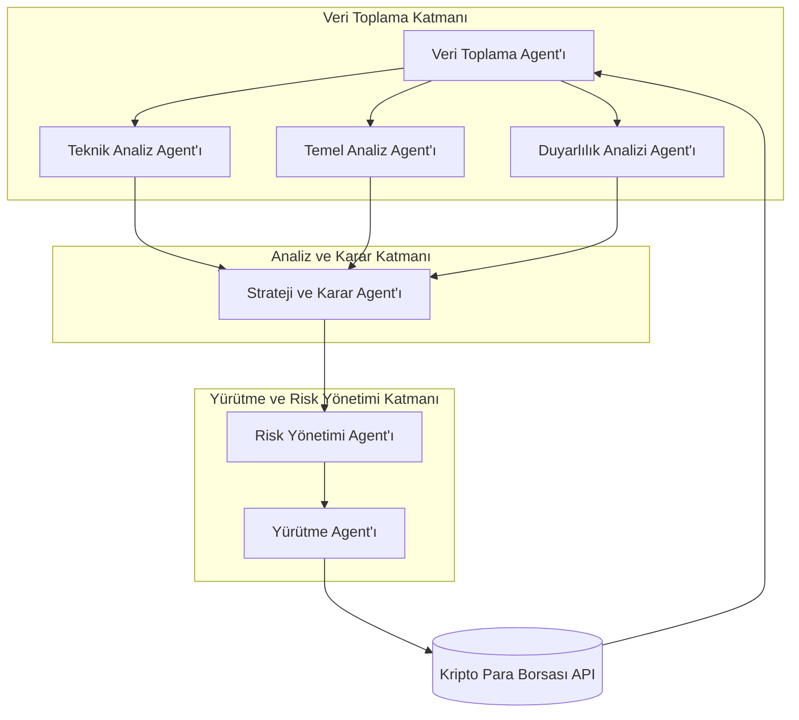

# Multi-Agent Kripto Para Al-Sat Yazılımı Geliştirme Rehberi

## Giriş

Bu rapor, kripto para alım-satım işlemleri için çoklu yapay zeka (multi-agent AI) tabanlı bir sistemin nasıl tasarlanıp geliştirileceğine dair kapsamlı bir araştırma ve rehber sunmaktadır. Kripto para piyasalarının 7/24 aktif olması, yüksek volatilitesi ve büyük miktarda veri üretmesi, bu alanda otomasyonu ve yapay zeka kullanımını cazip kılmaktadır. Multi-agent sistemler, karmaşık görevleri daha küçük ve yönetilebilir parçalara ayırarak, her biri belirli bir alanda uzmanlaşmış agent'ların işbirliği içinde çalışmasını sağlayarak bu zorlukların üstesinden gelmeyi hedefler.

Bu rehber, kavramsal çerçeveden başlayarak, mevcut teknolojilerin analizine, sistem mimarisinin tasarımına ve son olarak adım adım bir uygulama stratejisine kadar tüm süreci detaylı bir şekilde ele almaktadır.

---

## Bölüm 1: Multi-Agent Kripto Trading Sistemleri Araştırması

### 1.1. Temel Kavramlar ve Mimariler

Multi-agent trading sistemleri, genellikle her biri ticaret sürecinin farklı bir yönünden sorumlu olan otonom agent'lardan oluşur. Araştırmalarımızda öne çıkan iki temel mimari bulunmaktadır:

*   **Katmanlı Mimari:** Bu yaklaşımda sistem, Veri Toplama, Analiz ve Karar, Yürütme ve Risk Yönetimi gibi katmanlara ayrılır. Her katmanda farklı görevlere sahip agent'lar bulunur.
*   **Rol Tabanlı Mimari:** Bu yaklaşımda ise sistem, bir ticaret firmasını simüle eder. Analistler, araştırmacılar, tüccarlar ve risk yöneticileri gibi farklı rollere sahip agent'lar bulunur. Bu agent'lar, yapılandırılmış bir iletişim protokolü aracılığıyla işbirliği yapar.

### 1.2. Öne Çıkan Akademik ve Sektörel Çalışmalar

Araştırmalarımızda, özellikle Büyük Dil Modelleri (LLM) tabanlı multi-agent sistemlerin yükselişte olduğunu gözlemledik. İncelenen bazı önemli çalışmalar şunlardır:

*   **Designing a Detailed Multi-Agent Trading System Using Chatbots and AI:** Bu çalışma, beş temel agent rolü (Pazar Seçimi, Varlık Tahmini, Giriş Zamanlaması, İzleme, Karar) üzerine kurulu bir sistem önermektedir.
*   **LLM-Powered Multi-Agent System for Automated Crypto Portfolio Management (Arxiv):** Bu akademik makale, uzmanlaşmış agent'ların takımlar halinde çalıştığı, açıklanabilir ve çok modlu bir framework sunmaktadır. Sistem, agent'ları geçmiş veriler ve profesyonel literatür ile eğiterek (fine-tuning) daha isabetli kararlar almasını sağlamaktadır.
*   **TradingAgents Framework:** Bu çalışma, bir ticaret firmasını simüle eden yedi farklı agent rolü (Temel, Duyarlılık, Haber ve Teknik Analistler, Araştırmacı, Tüccar, Risk Yöneticisi) tanımlamaktadır. Bu framework, özellikle yapılandırılmış iletişim ve diyalektik tartışma süreçleri ile dikkat çekmektedir.

---

## Bölüm 2: Mevcut Çözümler ve Teknolojiler Analizi

### 2.1. Kripto Para Borsası API'leri

Başarılı bir trading botu için güvenilir ve kapsamlı borsa API'leri kritik öneme sahiptir. İncelemelerimiz sonucunda öne çıkan üç büyük borsa API'si şunlardır:

| Borsa | Avantajları | Dezavantajları |
|---|---|---|
| **Binance** | - En geniş varlık yelpazesi - Gelişmiş ticaret özellikleri (vadeli işlemler, opsiyonlar) - Yüksek likidite ve düşük işlem ücretleri | - Düzenleyici belirsizlikler - Yeni başlayanlar için karmaşık olabilir |
| **Coinbase** | - Kullanıcı dostu arayüz - Yüksek güvenlik ve ABD düzenlemelerine uyum - Kurumsal müşteriler için güçlü çözümler | - Daha az varlık seçeneği - Nispeten yüksek işlem ücretleri |
| **Kraken** | - Yüksek güvenlik standartları - Algoritmik ve yüksek frekanslı ticarete uygun API - İyi müşteri desteği | - Arayüzü daha az sezgisel olabilir - Likiditesi Binance kadar yüksek olmayabilir |

### 2.2. Multi-Agent Geliştirme Framework'leri

Python ekosisteminde multi-agent sistemler geliştirmek için çeşitli framework'ler bulunmaktadır. Popüler seçenekler şunlardır:

*   **CrewAI:** Rol tabanlı agent oluşturmayı kolaylaştıran, yüksek seviyeli bir framework. Başlangıç için idealdir.
*   **LangGraph:** LangChain ekosisteminin bir parçası olan, daha fazla kontrol ve esneklik sunan, grafik tabanlı bir yapı.
*   **Agno (eski adıyla Phidata):** Hazır UI bileşenleri ve kolay deployment seçenekleri sunan bir framework.
*   **Microsoft Agent Framework:** .NET ve Python desteği sunan, kurumsal odaklı bir çözüm.

### 2.3. Mevcut Trading Bot Platformları

Piyasada hem ticari hem de açık kaynak kodlu birçok trading bot platformu bulunmaktadır. Bunlar, sıfırdan bir sistem geliştirmek yerine hazır çözümler kullanmak isteyenler için bir alternatif olabilir.

*   **Ticari Platformlar:** Cryptohopper, 3Commas, Pionex
*   **Açık Kaynak Kodlu Platformlar:** Gekko, Freqtrade, Zenbot

---

## Bölüm 3: Teknik Mimari ve Gereksinimler

Önerilen sistem için modüler ve ölçeklenebilir bir mikroservis tabanlı mimari tasarlanmıştır.

### 3.1. Sistem Mimarisi

Sistem, üç ana katmandan oluşur:

1.  **Veri Toplama Katmanı:** Piyasa verilerini, haberleri ve sosyal medya duyarlılığını toplar.
2.  **Analiz ve Karar Katmanı:** Toplanan verileri analiz eder, stratejiler geliştirir ve sinyaller üretir.
3.  **Yürütme ve Risk Yönetimi Katmanı:** Sinyalleri alım-satım emirlerine dönüştürür ve portföy riskini yönetir.

### 3.2. Agent Rolleri ve Sorumlulukları

Sistemde aşağıdaki temel agent rolleri tanımlanmıştır:

*   Veri Toplama Agent'ı
*   Teknik Analiz Agent'ı
*   Temel Analiz Agent'ı
*   Duyarlılık Analizi Agent'ı
*   Strateji ve Karar Agent'ı
*   Risk Yönetimi Agent'ı
*   Yürütme Agent'ı

### 3.3. Teknoloji Seçimi

*   **Programlama Dili:** Python
*   **Multi-Agent Framework:** CrewAI
*   **Veri Analizi:** Pandas, NumPy, Scikit-learn
*   **Borsa Entegrasyonu:** CCXT kütüphanesi (birden çok borsayı destekler)
*   **Veritabanı:** PostgreSQL, InfluxDB

### 3.4. Veri Akışı Diyagramı

---

## Bölüm 4: Uygulama Stratejisi ve Adım Adım Rehber

Bu bölümde, tasarlanan sistemin Python ve CrewAI kullanılarak nasıl hayata geçirileceği adım adım açıklanmaktadır.

### Adım 1: Geliştirme Ortamının Kurulumu

Sanal bir Python ortamı oluşturun ve gerekli kütüphaneleri (`crewai`, `python-dotenv`, `langchain-openai`, `ccxt`, `pandas` vb.) `pip` ile yükleyin.

### Adım 2: Agent'ların Tanımlanması

Her bir agent'ı, rolü, hedefi, geçmiş hikayesi ve araçları ile birlikte CrewAI'nin `Agent` sınıfını kullanarak tanımlayın. Örneğin, `technical_analyst` agent'ı, piyasa verilerini analiz etme hedefine ve `get_market_data` gibi bir araca sahip olacaktır.

### Adım 3: Görevlerin (Tasks) Tanımlanması

Her bir agent'ın yapacağı işi, CrewAI'nin `Task` sınıfını kullanarak tanımlayın. Her görev, bir açıklama, beklenen çıktı ve görevi yürütecek agent'ı içerir.

### Adım 4: Crew'in Oluşturulması ve Çalıştırılması

Tanımlanan agent'ları ve görevleri bir `Crew` içinde birleştirin. Görevlerin işlenme sürecini (örneğin, sıralı - `Process.SEQUENTIAL`) belirleyin ve `kickoff()` metodu ile sistemi başlatın.

### Adım 5: Test ve İterasyon

*   **Backtesting:** Geliştirilen stratejiyi geçmiş veriler üzerinde test ederek performansını değerlendirin.
*   **Paper Trading:** Stratejiyi sanal para ile gerçek zamanlı piyasa koşullarında test edin.
*   **Optimizasyon:** Test sonuçlarına göre agent'ların stratejilerini ve parametrelerini iyileştirin.

## Sonuç

Bu rehber, multi-agent AI tabanlı bir kripto para al-sat yazılımı geliştirmek için kapsamlı bir yol haritası sunmaktadır. Önerilen mimari ve teknoloji yığını, modüler, ölçeklenebilir ve etkili bir sistem kurmak için sağlam bir temel oluşturur. Başarılı bir proje için sürekli araştırma, test ve iterasyonun kritik öneme sahip olduğu unutulmamalıdır.

## Referanslar

1.  Saghiri, A. M. (2024). *Designing a Detailed Multi-Agent Trading System Using Chatbots and AI*. Medium. [https://medium.com/@a.m.saghiri2008/designing-a-detailed-multi-agent-trading-system-using-chatbots-and-ai-general-solution-6db91e0510d7](https://medium.com/@a.m.saghiri2008/designing-a-detailed-multi-agent-trading-system-using-chatbots-and-ai-general-solution-6db91e0510d7)
2.  Luo, Y., et al. (2025). *LLM-Powered Multi-Agent System for Automated Crypto Portfolio Management*. arXiv. [https://arxiv.org/abs/2501.00826](https://arxiv.org/abs/2501.00826)
3.  TradingAgents. (n.d.). *TradingAgents: Multi-Agents LLM Financial Trading Framework*. [https://tradingagents-ai.github.io/](https://tradingagents-ai.github.io/)
4.  GetStream. (2024). *Best 5 Frameworks To Build Multi-Agent AI Applications*. [https://getstream.io/blog/multiagent-ai-frameworks/](https://getstream.io/blog/multiagent-ai-frameworks/)
5.  Coinbase. (n.d.). *Coinbase Developer Documentation*. [https://docs.cloud.coinbase.com/](https://docs.cloud.coinbase.com/)
6.  CrewAI. (n.d.). *CrewAI Documentation*. [https://www.crewai.com/](https://www.crewai.com/)

