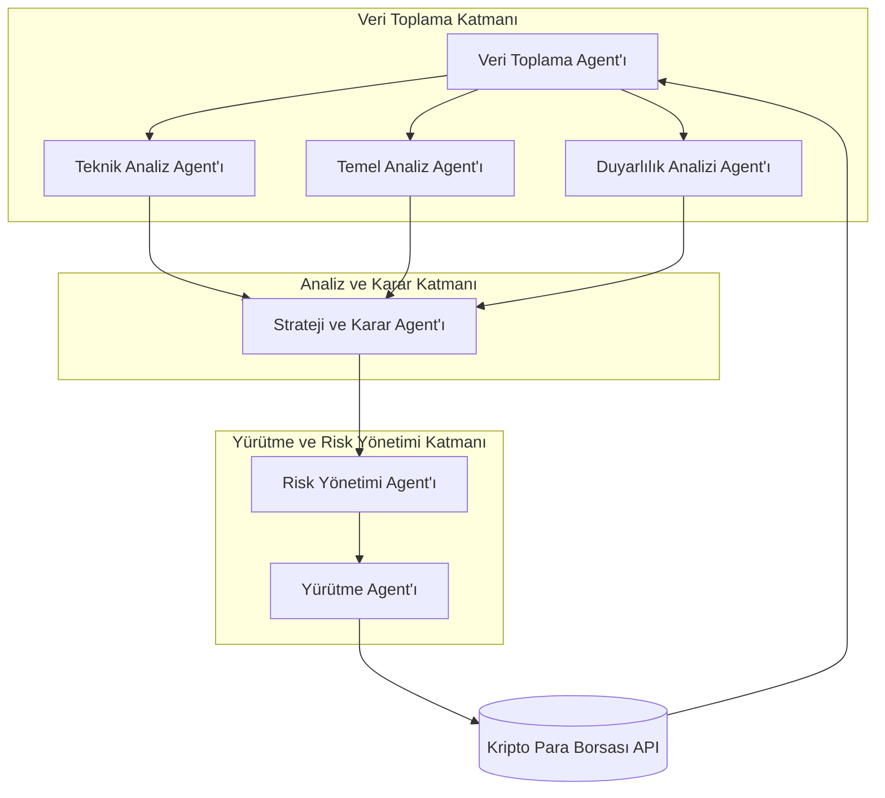

# Multi-Agent Kripto Trading Sistemi: Teknik Mimari ve Gereksinimler

## 1. Genel Sistem Mimarisi

Önerilen sistem, mikroservis tabanlı bir mimari üzerine inşa edilmiş, modüler ve ölçeklenebilir bir multi-agent yapısıdır. Sistem, her biri belirli bir görevde uzmanlaşmış bir grup AI agent'ından oluşur. Bu agent'lar, otonom olarak veya birbirleriyle işbirliği içinde çalışarak kripto para piyasalarında alım-satım kararları verir ve uygular.

Sistem, üç ana katmandan oluşur:

1.  **Veri Toplama Katmanı:** Piyasa verilerini, haberleri ve sosyal medya duyarlılığını toplayan ve işleyen agent'ları içerir.
2.  **Analiz ve Karar Katmanı:** Toplanan verileri analiz eden, ticaret stratejileri geliştiren ve alım-satım sinyalleri üreten agent'ları barındırır.
3.  **Yürütme ve Risk Yönetimi Katmanı:** Üretilen sinyalleri borsalarda alım-satım emirlerine dönüştüren ve genel portföy riskini yöneten agent'ları kapsar.

## 2. Agent Rolleri ve Sorumlulukları

Sistemde yer alacak temel agent rolleri ve sorumlulukları aşağıdaki tabloda özetlenmiştir:

| Agent Rolü | Sorumlulukları |
|---|---|
| **Veri Toplama Agent'ı** | - Kripto para borsalarından (Binance, Coinbase, Kraken vb.) gerçek zamanlı ve geçmişe dönük piyasa verilerini (fiyat, hacim) toplar. - Haber sitelerinden ve API'lerden (NewsAPI vb.) finansal haberleri ve makaleleri çeker. - Sosyal medya platformlarından (Twitter, Reddit vb.) kripto paralarla ilgili duyarlılık verilerini toplar. |
| **Teknik Analiz Agent'ı** | - Toplanan piyasa verileri üzerinde teknik analiz göstergeleri (RSI, MACD, Bollinger Bantları vb.) hesaplar. - Fiyat grafiklerinde formasyonları (destek/direnç, trend çizgileri) tespit eder. - Kısa ve orta vadeli alım-satım sinyalleri üretir. |
| **Temel Analiz Agent'ı** | - Proje whitepaper'larını, yol haritalarını ve geliştirici aktivitelerini analiz eder. - Token ekonomisi (tokenomics) ve on-chain metrikleri (işlem sayısı, aktif adresler) inceler. - Uzun vadeli yatırım potansiyelini değerlendirir. |
| **Duyarlılık Analizi Agent'ı** | - Haber ve sosyal medya verileri üzerinde doğal dil işleme (NLP) teknikleri kullanarak duyarlılık analizi yapar. - Piyasa duyarlılığını (pozitif, negatif, nötr) ve trend konuları belirler. |
| **Strateji ve Karar Agent'ı** | - Teknik, temel ve duyarlılık analizi agent'larından gelen sinyalleri birleştirir. - Önceden tanımlanmış veya dinamik olarak geliştirilen ticaret stratejilerine göre nihai alım, satım veya tutma kararını verir. - Makine öğrenmesi modelleri ile stratejileri optimize eder. |
| **Risk Yönetimi Agent'ı** | - Portföyün genel riskini izler ve yönetir. - Zarar durdur (stop-loss) ve kar al (take-profit) seviyelerini belirler. - Pozisyon büyüklüğünü ve sermaye dağılımını optimize eder. |
| **Yürütme Agent'ı** | - Strateji ve Karar Agent'ından gelen kararları borsalarda (Binance, Coinbase vb.) API aracılığıyla alım-satım emirlerine dönüştürür. - Emirlerin durumunu (dolduruldu, iptal edildi vb.) takip eder. - Emirlerin en iyi fiyattan gerçekleşmesi için slippage kontrolü yapar. |

## 3. Teknoloji ve Framework Seçimi

- **Programlama Dili:** Python (veri bilimi, makine öğrenmesi ve API entegrasyonu için zengin kütüphane ekosistemi nedeniyle)
- **Multi-Agent Framework:** CrewAI (rol tabanlı agent oluşturma kolaylığı ve yüksek seviye soyutlama sunması nedeniyle başlangıç için uygun)
- **Veri Analizi ve Makine Öğrenmesi:** Pandas, NumPy, Scikit-learn, TensorFlow/PyTorch
- **Borsa Entegrasyonu:** Binance API, Coinbase API (kapsamlı özellikleri ve iyi dokümantasyonları nedeniyle)
- **Veritabanı:** PostgreSQL (yapılandırılmış veriler için), InfluxDB (zaman serisi verileri için)
- **Mesajlaşma Kuyruğu:** RabbitMQ veya Kafka (agent'lar arası asenkron iletişim için)

## 4. Veri Akışı ve İletişim

Agent'lar arasındaki iletişim, bir mesajlaşma kuyruğu üzerinden asenkron olarak gerçekleştirilecektir. Bu, sistemin esnekliğini ve ölçeklenebilirliğini artıracaktır. Veri akışı aşağıdaki diyagramda gösterilmiştir:

## 5. Donanım ve Yazılım Gereksinimleri

- **Sunucu:** En az 4 CPU çekirdeği, 16 GB RAM ve 256 GB SSD depolama alanına sahip bir bulut sunucusu (AWS, Google Cloud, Azure vb.).
- **İşletim Sistemi:** Ubuntu 22.04 LTS veya benzeri bir Linux dağıtımı.
- **Yazılım:** Python 3.10+, Docker, Docker Compose, ve yukarıda belirtilen diğer teknoloji ve kütüphaneler.
